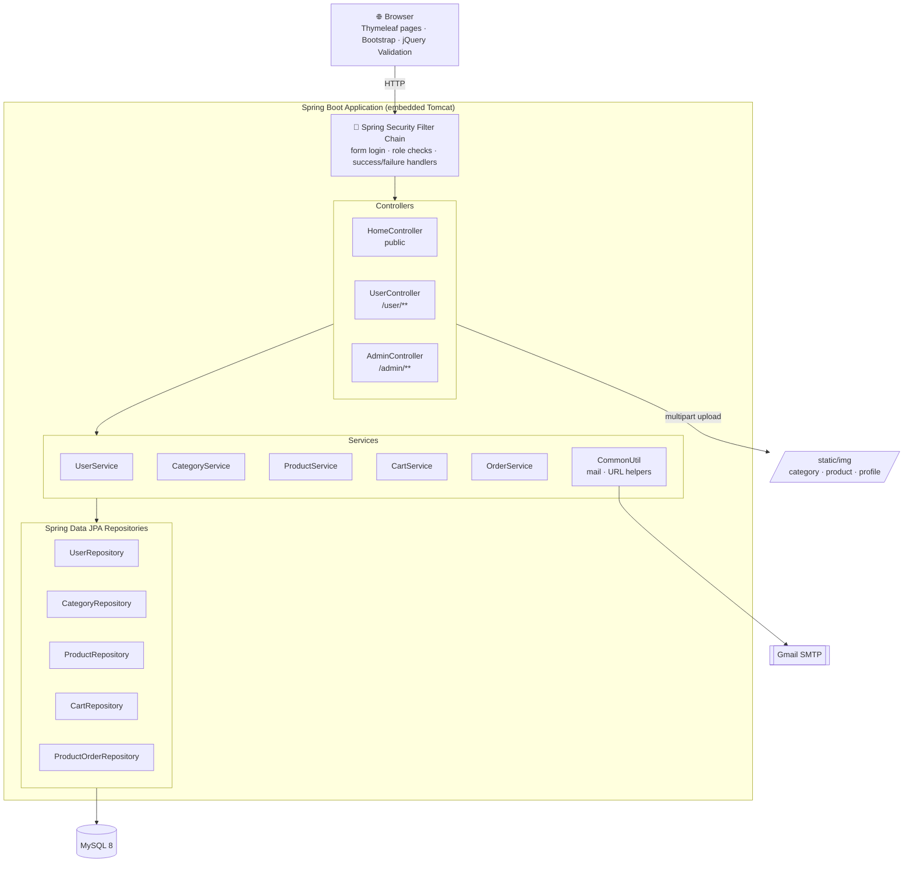
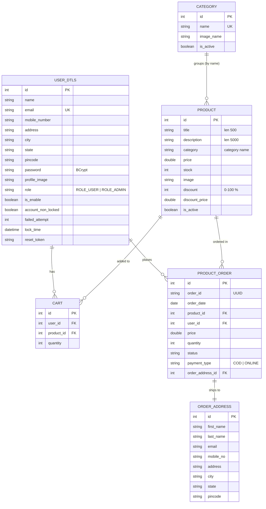
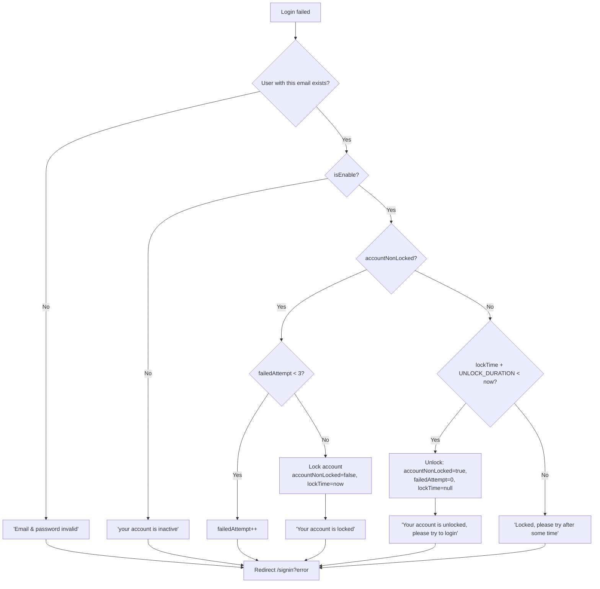
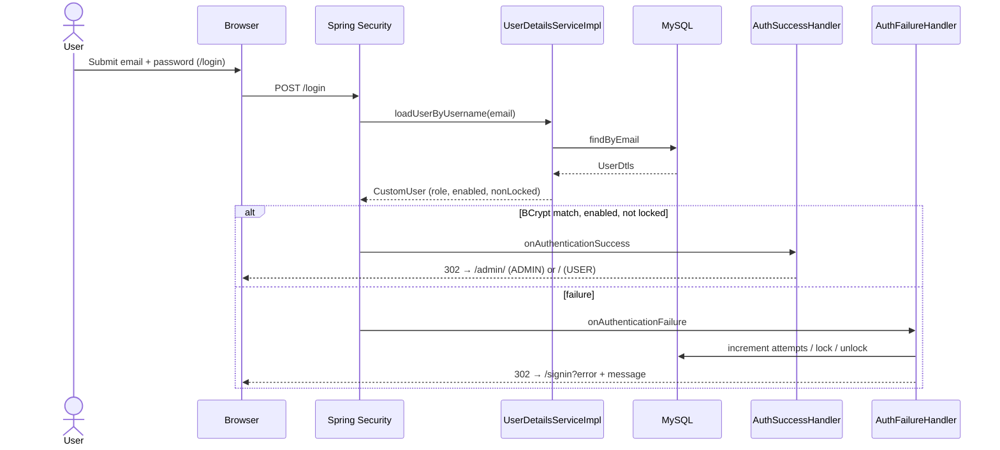
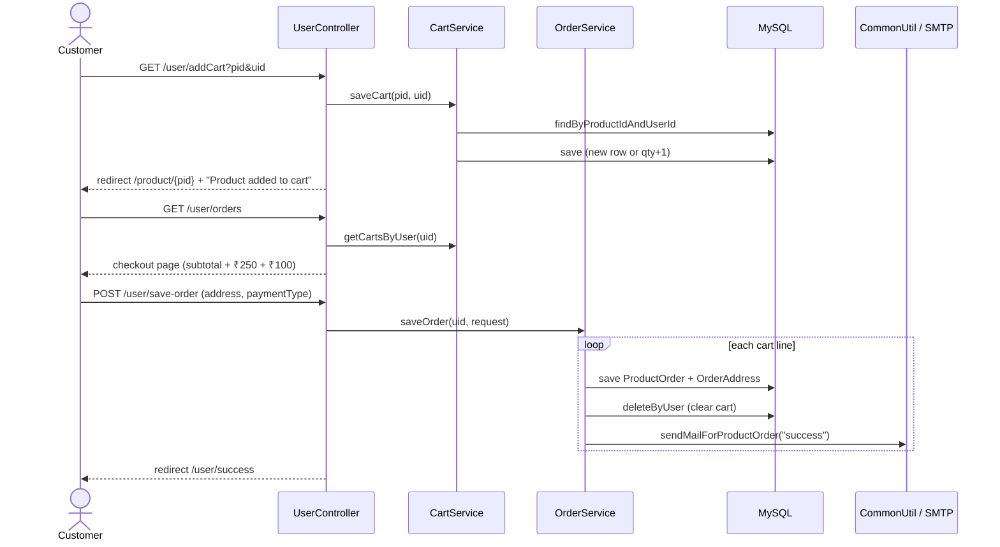
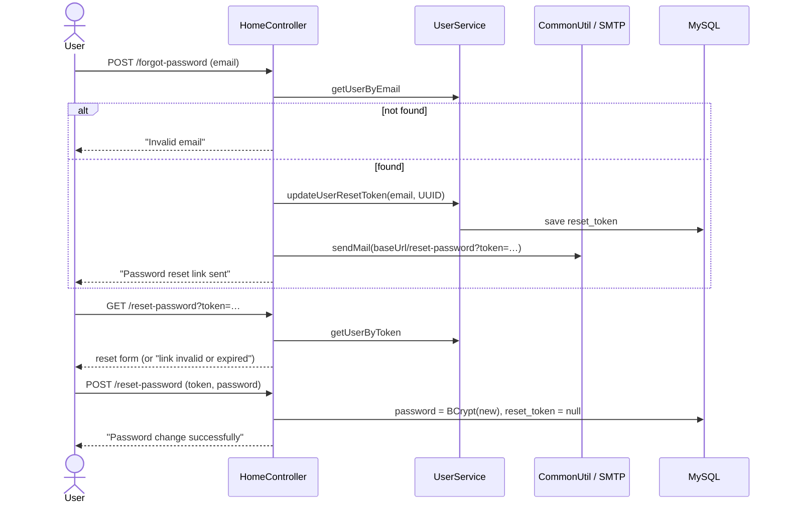
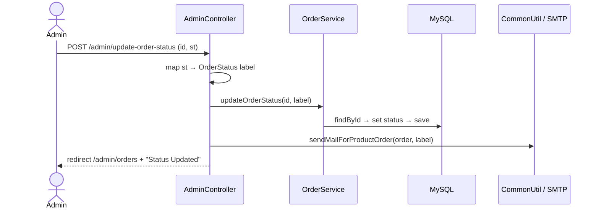
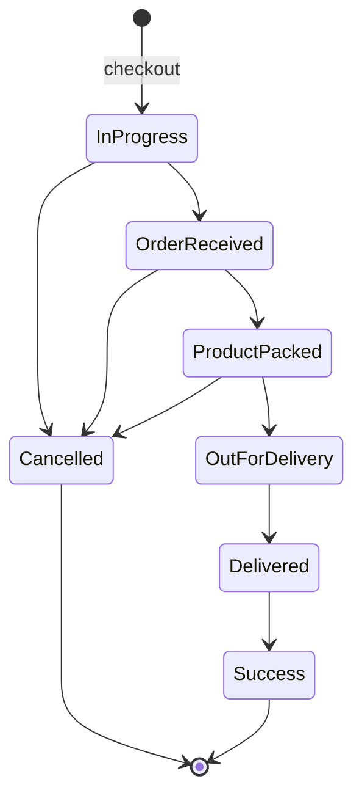
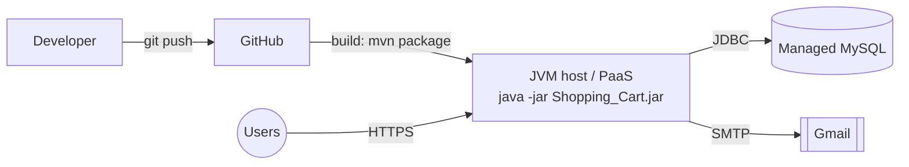

# 📊 SakuraMart — Project Report & Technical Documentation

| | |
|---|---|
| **Project name** | SakuraMart: Spring Boot E-Commerce Platform |
| **Artifact** | `com.ecom:Shopping_Cart` |
| **Version** | 0.0.1-SNAPSHOT |
| **Author** | Deepak ([@deepak5671](https://github.com/deepak5671)) |
| **Repository** | https://github.com/deepak5671/Ecommerce_project |
| **Tech stack** | Java 17 · Spring Boot 3.2.3 · Spring Security 6 · Spring Data JPA · Hibernate · MySQL 8 · Thymeleaf · Bootstrap 5.3 · Spring Mail |

---

## Table of Contents

1. [Executive Summary](#1-executive-summary)
2. [Objectives & Scope](#2-objectives--scope)
3. [Technology Stack](#3-technology-stack)
4. [System Architecture](#4-system-architecture)
5. [Database Design](#5-database-design)
6. [Endpoint Reference](#6-endpoint-reference)
7. [Module Design](#7-module-design)
8. [Sequence Diagrams](#8-sequence-diagrams)
9. [Security Design](#9-security-design)
10. [Business Rules](#10-business-rules)
11. [User Interface](#11-user-interface)
12. [Configuration & Deployment](#12-configuration--deployment)
13. [Testing](#13-testing)
14. [Known Limitations](#14-known-limitations)
15. [Future Enhancements](#15-future-enhancements)
16. [Conclusion](#16-conclusion)

---

## 1. Executive Summary

SakuraMart is a server-rendered e-commerce web application built on Spring Boot. It covers the core flow of an online store: **catalog browsing → cart → checkout → order fulfilment**. There are two separate role-based portals:

- **Customer portal:** product discovery (category filter, search, pagination), a persistent cart, checkout with address and payment-mode selection, order history with cancellation, and profile management.
- **Admin portal:** category and product management (including image upload and discounts), order management with status updates, user management (enable/disable), and admin onboarding.

The cross-cutting concerns are handled by these parts of the stack:

- **Spring Security:** BCrypt hashing, role-based access, custom login success/failure handlers, and brute-force account lockout.
- **Spring Mail:** order confirmation, status-change notification, and password-reset emails.
- **Spring Data JPA:** persistence, including derived queries and pagination.

### Key achievements

- ✅ Layered MVC architecture: Controller → Service (interface + impl) → Repository → Entity
- ✅ Role-based authorization with separate customer and admin URL spaces
- ✅ Account lockout after repeated failed logins, with automatic time-based unlock
- ✅ Token-based password reset by email
- ✅ Server-side pagination on every listing (products, categories, orders)
- ✅ Discount engine with automatic discounted-price calculation
- ✅ A 7-state order lifecycle with an email notification on every transition
- ✅ Environment-driven configuration (`DB_URL`, `DB_USERNAME`, `DB_PASSWORD`, `PORT`) for cloud deployment

---

## 2. Objectives & Scope

### Objectives

1. Build a complete, working online store with a clear separation between customer and admin.
2. Apply **Spring Security** correctly: hashed credentials, role-based access, and protection against brute-force logins.
3. Model the e-commerce domain (users, categories, products, carts, orders, addresses) with **JPA relationships**.
4. Keep administrators and customers informed through **transactional emails**.
5. Keep the code maintainable with interfaces, dependency injection, and layered packages.

### In scope

| Area | Included |
|---|---|
| Authentication | Register, login, logout, forgot/reset password, change password |
| Authorization | `ROLE_USER`, `ROLE_ADMIN` |
| Catalog | Categories and products with images, active flags, stock, and discounts |
| Discovery | Category filter, keyword search, pagination |
| Cart | Add, increment, decrement, remove at zero, running totals |
| Orders | Checkout, address capture, COD/Online selection, status tracking, cancellation |
| Admin | Catalog CRUD, order search and status updates, user enable/disable, add admin |
| Notifications | Email on order placement, status change, and password reset |

### Out of scope (current version)

- A real online-payment gateway (the "Online" option is recorded but not processed)
- Inventory reservation and decrement
- A public REST/JSON API and SPA/mobile clients
- Automated test suites

---

## 3. Technology Stack

| Layer | Technology | Purpose |
|---|---|---|
| Language | **Java 17** | Records-era LTS runtime |
| Framework | **Spring Boot 3.2.3** | Auto-configuration, embedded Tomcat |
| Web | Spring Web MVC | Controllers, model binding, multipart upload |
| Security | **Spring Security 6** | Form login, role-based authorization, BCrypt |
| Persistence | **Spring Data JPA + Hibernate** | ORM, derived queries, pagination |
| Database | **MySQL 8** (`mysql-connector-j`) | Relational storage |
| Templates | **Thymeleaf** | Server-side rendering, layout via `base.html` |
| UI | Bootstrap 5.3.3, Font Awesome 6.5.1 | Responsive layout and icons |
| Client validation | jQuery 3.7.1 + jQuery Validation 1.19.5 | Form validation (`static/js/script.js`) |
| Mail | Spring Boot Starter Mail | Gmail SMTP (TLS on port 587) |
| Boilerplate | Lombok | Getters, setters, constructors |
| Build | Maven + Maven Wrapper | Build and dependency management |
| Dev | Spring Boot DevTools | Hot reload |

---

## 4. System Architecture

### 4.1 High-level architecture



### 4.2 Layer responsibilities

| Layer | Package | Responsibility |
|---|---|---|
| Configuration | `com.ecom.config` | Security filter chain, `UserDetailsService`, auth handlers, `CustomUser` adapter |
| Controller | `com.ecom.controller` | Request mapping, model population, session flash messages, file upload |
| Service | `com.ecom.service`, `service.impl` | Business logic: pricing, cart maths, order creation, lockout, tokens |
| Repository | `com.ecom.repository` | Data access through Spring Data derived queries |
| Model | `com.ecom.model` | JPA entities plus the `OrderRequest` DTO |
| Utility | `com.ecom.util` | `CommonUtil` (mail, URL generation, current user), `OrderStatus`, `AppConstant` |

### 4.3 Package structure

```
com.ecom
├── ShoppingCartApplication.java
├── config
│   ├── SecurityConfig.java            # filter chain, BCrypt, DaoAuthenticationProvider
│   ├── UserDetailsServiceImpl.java    # loads user by email
│   ├── CustomUser.java                # UserDetails adapter over UserDtls
│   ├── AuthSucessHandlerImpl.java     # role-based redirect after login
│   └── AuthFailureHandlerImpl.java    # failed-attempt counting and lockout
├── controller
│   ├── HomeController.java            # public pages, register, password reset
│   ├── UserController.java            # cart, checkout, orders, profile
│   └── AdminController.java           # catalog, orders, users, admins
├── model
│   ├── UserDtls.java · Category.java · Product.java
│   ├── Cart.java · ProductOrder.java · OrderAddress.java
│   └── OrderRequest.java              # checkout form DTO
├── repository                         # 5 JpaRepository interfaces
├── service                            # 6 interfaces (+ CommonService)
│   └── impl                           # 5 implementations
└── util
    ├── CommonUtil.java
    ├── OrderStatus.java
    └── AppConstant.java
```

### 4.4 Cross-cutting patterns

- **Global model attributes:** each controller has a `@ModelAttribute getUserDetails(...)` method. It adds the logged-in `user`, the cart item count (`countCart`) and the active categories to every view, so the navbar always has current data.
- **Flash messaging:** controllers store `succMsg` / `errorMsg` in the `HttpSession`. Templates render them, then call `CommonService.removeSessionMessage()` to clear them.
- **Post/Redirect/Get:** every state-changing POST ends with `redirect:`, which prevents duplicate form submissions on refresh.
- **Interface-driven services:** controllers depend on service interfaces, so implementations can be swapped or mocked.

---

## 5. Database Design

The schema is generated by Hibernate (`ddl-auto=update`) from the JPA entities.

### 5.1 Entity-relationship diagram



### 5.2 Table descriptions

| Table | Entity | Notes |
|---|---|---|
| `user_dtls` | `UserDtls` | Customers and admins share one table and are told apart by `role`. It also holds the lockout fields (`failed_attempt`, `account_non_locked`, `lock_time`) and `reset_token`. |
| `category` | `Category` | `name` is unique (checked by the service before saving). Inactive categories are hidden from customers. |
| `product` | `Product` | `discount_price` is stored rather than computed on read. `category` stores the category **name**. |
| `cart` | `Cart` | One row per (user, product) pair. `totalPrice` and `totalOrderPrice` are `@Transient` and calculated on every read. |
| `product_order` | `ProductOrder` | **One row per product line**. Each line has its own UUID `order_id`, and the **price is snapshotted** at checkout time. |
| `order_address` | `OrderAddress` | `@OneToOne(cascade = ALL)` with `ProductOrder`. It is a snapshot of the shipping details, independent of later profile edits. |

### 5.3 Design decisions

- **Price snapshot:** `ProductOrder.price` copies `Product.discountPrice` when the order is placed, so later price changes don't rewrite order history.
- **Address snapshot:** the shipping address is stored per order instead of referencing the user profile.
- **Transient cart totals:** cart line totals and the running total are recalculated from current product prices each time the cart is shown, so the cart never shows stale prices.

---

## 6. Endpoint Reference

All endpoints are server-rendered (they return views or redirects). The **Access** column reflects the rules in `SecurityConfig`.

### 6.1 Public — `HomeController`

| Method | Path | Params | Description | View / Redirect |
|---|---|---|---|---|
| GET | `/` | — | Home page: latest **6** active categories and latest **8** active products | `index` |
| GET | `/signin` | — | Login page | `login` |
| POST | `/login` | `username`, `password` | Processed by Spring Security | → `/admin/` or `/` |
| GET | `/register` | — | Registration page | `register` |
| POST | `/saveUser` | `UserDtls` fields, `img` (file) | Register a customer; rejects duplicate email | → `/register` |
| GET | `/products` | `category`, `ch`, `pageNo` (0), `pageSize` (12) | Product listing with category filter, search, and pagination | `product` |
| GET | `/product/{id}` | — | Product details | `view_product` |
| GET | `/search` | `ch` | Keyword search on title or category | `product` |
| GET | `/forgot-password` | — | Forgot-password form | `forgot_password` |
| POST | `/forgot-password` | `email` | Generate a UUID token and email the reset link | → `/forgot-password` |
| GET | `/reset-password` | `token` | Validate the token and show the form | `reset_password` / `message` |
| POST | `/reset-password` | `token`, `password` | Set the new password and clear the token | `message` |

### 6.2 Customer — `UserController` (`/user/**`, `ROLE_USER`)

| Method | Path | Params | Description |
|---|---|---|---|
| GET | `/user/` | — | Customer home |
| GET | `/user/addCart` | `pid`, `uid` | Add a product to the cart, or increment it if already present |
| GET | `/user/cart` | — | Cart with line totals and grand total |
| GET | `/user/cartQuantityUpdate` | `sy` (`in`/`de`), `cid` | Increment or decrement; the line is removed when quantity reaches 0 |
| GET | `/user/orders` | — | Checkout page (subtotal + ₹250 delivery + ₹100 tax) |
| POST | `/user/save-order` | `OrderRequest` | Create orders from the cart, clear the cart, send emails |
| GET | `/user/success` | — | Order success page |
| GET | `/user/user-orders` | — | Order history |
| GET | `/user/update-status` | `id`, `st` | Update own order status (used for **cancel**) and email the customer |
| GET | `/user/profile` | — | Profile page |
| POST | `/user/update-profile` | `UserDtls` fields, `img` | Update profile and photo |
| POST | `/user/change-password` | `currentPassword`, `newPassword` | Change password after verifying the current one |

### 6.3 Admin — `AdminController` (`/admin/**`, `ROLE_ADMIN`)

| Method | Path | Params | Description |
|---|---|---|---|
| GET | `/admin/` | — | Admin dashboard |
| GET | `/admin/category` | `pageNo`, `pageSize` (10) | Paginated category list and create form |
| POST | `/admin/saveCategory` | `name`, `isActive`, `file` | Create a category (unique name) with an image |
| GET | `/admin/loadEditCategory/{id}` | — | Edit category form |
| POST | `/admin/updateCategory` | `id`, `name`, `isActive`, `file` | Update a category, keeping the old image if none is uploaded |
| GET | `/admin/deleteCategory/{id}` | — | Delete a category |
| GET | `/admin/loadAddProduct` | — | Add product form |
| POST | `/admin/saveProduct` | `Product` fields, `file` | Create a product (discount 0, discountPrice = price) |
| GET | `/admin/products` | `ch`, `pageNo`, `pageSize` (10) | Paginated product list and search |
| GET | `/admin/editProduct/{id}` | — | Edit product form |
| POST | `/admin/updateProduct` | `Product` fields, `file` | Update a product and recalculate the discounted price (rejects discounts outside 0–100) |
| GET | `/admin/deleteProduct/{id}` | — | Delete a product |
| GET | `/admin/orders` | `pageNo`, `pageSize` (10) | Paginated list of all orders |
| GET | `/admin/search-order` | `orderId` | Find an order by UUID order ID |
| POST | `/admin/update-order-status` | `id`, `st` | Change order status and email the customer |
| GET | `/admin/users` | `type` (1 = users, 2 = admins) | List accounts by role |
| GET | `/admin/updateSts` | `id`, `status`, `type` | Enable or disable an account |
| GET | `/admin/add-admin` | — | Add admin form |
| POST | `/admin/save-admin` | `UserDtls` fields, `img` | Create a `ROLE_ADMIN` account |
| GET | `/admin/profile` | — | Admin profile |
| POST | `/admin/update-profile` | `UserDtls` fields, `img` | Update admin profile |
| POST | `/admin/change-password` | `currentPassword`, `newPassword` | Change admin password |

---

## 7. Module Design

### 7.1 Authentication & account module

| Component | Role |
|---|---|
| `UserDetailsServiceImpl` | Loads `UserDtls` by email and wraps it in `CustomUser`. |
| `CustomUser` | Maps `role` → `GrantedAuthority`, `isEnable` → `isEnabled()`, and `accountNonLocked` → `isAccountNonLocked()`. |
| `AuthSucessHandlerImpl` | Redirects `ROLE_ADMIN` to `/admin/` and everyone else to `/`. |
| `AuthFailureHandlerImpl` | Counts failed attempts, locks or unlocks the account, and translates errors into user-friendly messages. |
| `UserServiceImpl` | Registration (`saveUser` / `saveAdmin` set role, enabled, unlocked, 0 attempts, BCrypt password), lockout helpers, reset tokens, profile updates. |

**Failed-login decision tree (`AuthFailureHandlerImpl`):**



### 7.2 Catalog module

- **Categories:** unique by name and activatable. Only active categories appear in the customer navbar and filters (`findByIsActiveTrue`).
- **Products:** have title, description, category, price, stock, image, discount and active flag.
  - On **create**, `discount = 0` and `discountPrice = price`.
  - On **update**, `discountPrice = price − price × discount / 100`. The controller rejects discounts below 0 or above 100.
- **Search:** `findByTitleContainingIgnoreCaseOrCategoryContainingIgnoreCase`, with paginated variants for both the admin and customer listings.
- **Images:** uploaded through `MultipartFile` and copied to `static/img/{category_img|product_img|profile_img}`. If no file is uploaded, `default.jpg` is used. The maximum file and request size is 50 MB.

### 7.3 Cart module (`CartServiceImpl`)

| Operation | Behaviour |
|---|---|
| `saveCart(pid, uid)` | If the (product, user) pair already has a row, quantity +1. Otherwise create a row with quantity 1. |
| `getCartsByUser(uid)` | Recomputes each line's `totalPrice = discountPrice × qty` and a **running** `totalOrderPrice`. The last element holds the grand total. |
| `updateQuantity(sy, cid)` | `sy = "de"` decrements, and the row is deleted when quantity ≤ 0. Any other value increments. |
| `getCountCart(uid)` | Number of cart lines (shown as the navbar badge). |

### 7.4 Order module (`OrderServiceImpl`)

`saveOrder(userId, OrderRequest)` runs these steps:
1. Load all cart lines for the user.
2. For each line, create a `ProductOrder` with:
   - a new **UUID** `orderId` and today's date
   - the product, the price snapshot (`discountPrice`) and the quantity
   - status **In Progress** and the chosen payment type
   - an `OrderAddress` built from the checkout form
3. Save the order (the address is persisted through the cascade), clear the user's cart (`deleteByUser`), and send a confirmation email.

Status updates (`updateOrderStatus`) map the numeric `st` to an `OrderStatus` label, save it, and send a status email.

### 7.5 Notification module (`CommonUtil`)

| Email | Trigger | Content |
|---|---|---|
| Password reset | `POST /forgot-password` | HTML link to `{baseUrl}/reset-password?token={uuid}` |
| Order confirmation | Each order line on checkout | Name, status, product, category, quantity, price, payment type |
| Status update | Admin or customer status change | Same template with the new status |

`generateUrl(request)` builds the base URL from the incoming request, so reset links work both on `localhost` and when deployed.

---

## 8. Sequence Diagrams

### 8.1 Login with role-based redirect



### 8.2 Add to cart → checkout



### 8.3 Forgot / reset password



### 8.4 Admin order status update



---

## 9. Security Design

### 9.1 Filter chain (`SecurityConfig`)

```java
http.csrf(csrf -> csrf.disable()).cors(cors -> cors.disable())
    .authorizeHttpRequests(req -> req
        .requestMatchers("/user/**").hasRole("USER")
        .requestMatchers("/admin/**").hasRole("ADMIN")
        .requestMatchers("/**").permitAll())
    .formLogin(form -> form.loginPage("/signin")
        .loginProcessingUrl("/login")
        .failureHandler(authenticationFailureHandler)
        .successHandler(authenticationSuccessHandler))
    .logout(logout -> logout.permitAll());
```

### 9.2 Controls implemented

| Threat | Control |
|---|---|
| Credential theft from the database | **BCrypt** hashing (`BCryptPasswordEncoder`) for every password |
| Privilege escalation | URL-level role checks; admin accounts can only be created by admins |
| Brute-force login | Failed-attempt counter, account lock, and time-based unlock |
| Abuse by a compromised account | Admin can disable any account (`isEnable = false`) |
| Password recovery abuse | Random **UUID** token, single use (cleared after reset) |
| Changing a password from a hijacked session | The current password is required before a new one is set |
| Secret leakage | Database credentials come from environment variables (`DB_URL`, `DB_USERNAME`, `DB_PASSWORD`) |

### 9.3 Lockout parameters (`AppConstant`)

| Constant | Value | Meaning |
|---|---|---|
| `ATTEMPT_TIME` | `3` | Failed attempts recorded before the next failure locks the account |
| `UNLOCK_DURATION_TIME` | `3000` ms | Lock duration. This is a short value for testing; the code comment gives the production value as `1 * 60 * 60 * 1000` (1 hour). |

---

## 10. Business Rules

| Rule | Implementation |
|---|---|
| Discounted price | `discountPrice = price − price × (discount / 100)`, with discount limited to 0–100 |
| New product | `discount = 0`, `discountPrice = price` |
| Cart line total | `discountPrice × quantity` |
| Checkout total | `cart subtotal + ₹250 delivery fee + ₹100 tax` |
| Order price | Snapshot of `discountPrice` at checkout |
| Order granularity | One `ProductOrder` (with its own UUID) per cart line |
| Cart after checkout | Cleared |
| Currency | `rupee.sign` property (default `₹`), shown in the templates |
| Visibility | Customers see only **active** categories and products |
| Home page | Latest 6 active categories and latest 8 active products (by ID, newest first) |

### Order status lifecycle

| ID | Status | Set by |
|---|---|---|
| 1 | In Progress | System (on checkout) |
| 2 | Order Received | Admin |
| 3 | Product Packed | Admin |
| 4 | Out for Delivery | Admin |
| 5 | Delivered | Admin |
| 6 | Cancelled | Customer / Admin |
| 7 | Success | Admin |



---

## 11. User Interface

All pages extend a common `base.html` layout (navbar with categories, cart badge and profile menu; flash messages; footer). Client-side validation is handled by jQuery Validation rules in `static/js/script.js`.

| Area | Templates |
|---|---|
| Public | `index.html`, `product.html`, `view_product.html`, `login.html`, `register.html`, `forgot_password.html`, `reset_password.html`, `message.html` |
| Customer | `user/home.html`, `user/cart.html`, `user/order.html`, `user/success.html`, `user/my_orders.html`, `user/profile.html` |
| Admin | `admin/index.html`, `admin/category.html`, `admin/edit_category.html`, `admin/add_product.html`, `admin/products.html`, `admin/edit_product.html`, `admin/orders.html`, `admin/users.html`, `admin/add_admin.html`, `admin/profile.html` |

---

## 12. Configuration & Deployment

### 12.1 `application.properties`

| Property | Value | Purpose |
|---|---|---|
| `spring.datasource.url` | `${DB_URL}` | JDBC URL |
| `spring.datasource.username` / `password` | `${DB_USERNAME}` / `${DB_PASSWORD}` | Database credentials |
| `spring.jpa.hibernate.ddl-auto` | `update` | Auto-create and evolve the schema |
| `spring.jpa.properties.hibernate.dialect` | `MySQL8Dialect` | SQL dialect |
| `server.port` | `${PORT:8080}` | Port (works with PaaS-assigned ports) |
| `spring.mail.host` / `port` | `smtp.gmail.com` / `587` | SMTP with STARTTLS |
| `spring.servlet.multipart.max-file-size` | `50MB` | Upload limit |
| `rupee.sign` | `${RUPEE_SIGN:&#8377;}` | Currency symbol |

### 12.2 Local run

```bash
export DB_URL="jdbc:mysql://localhost:3306/shopping_cart"
export DB_USERNAME="root"
export DB_PASSWORD="••••"
cd shopping-cart-spring-boot
./mvnw spring-boot:run
```

### 12.3 Deployment

The app is packaged as a single executable JAR (`./mvnw clean package`). Because the port and database come from environment variables, it can run on any JVM host or PaaS (Render, Railway, AWS Elastic Beanstalk, a VM) next to a managed MySQL instance.



---

## 13. Testing

Testing was done manually through the browser, using a local MySQL database and a real Gmail SMTP account. The project includes the Spring Boot test starter for future automated tests.

### 13.1 Functional test cases

| # | Scenario | Steps | Expected result |
|---|---|---|---|
| T1 | Register | Fill in the form at `/register` | "Register successfully"; user saved with `ROLE_USER` and a BCrypt password |
| T2 | Duplicate email | Register again with the same email | "Email already exist" |
| T3 | Login redirect | Log in as a customer, then as an admin | Customer → `/`, Admin → `/admin/` |
| T4 | Access control | Visit `/admin/` as a customer | Access denied |
| T5 | Account lockout | Enter a wrong password repeatedly | Attempts counted, then "Your account is locked" |
| T6 | Auto unlock | Wait longer than the unlock duration and retry | "Your account is unlocked" |
| T7 | Disabled account | Admin disables a user; the user logs in | "your account is inactive" |
| T8 | Forgot password | Submit an email at `/forgot-password` | Reset email received; the link opens the reset form |
| T9 | Reset token reuse | Open the same link after resetting | "Your link is invalid or expired" |
| T10 | Category uniqueness | Create two categories with the same name | "Category Name already exists" |
| T11 | Discount | Set a 20% discount on a ₹1000 product | Discounted price is ₹800 |
| T12 | Invalid discount | Set the discount to 150 | "invalid Discount" |
| T13 | Cart increment | Add the same product twice | One line with quantity 2 |
| T14 | Cart decrement to zero | Decrement a line with quantity 1 | Line removed |
| T15 | Checkout totals | Open checkout with a ₹800 subtotal | Total = ₹800 + ₹250 + ₹100 = ₹1150 |
| T16 | Place order | Submit checkout | Orders created as "In Progress", cart cleared, confirmation email sent |
| T17 | Status update | Admin sets the order to "Product Packed" | Status updated and customer emailed |
| T18 | Order search | Admin searches by UUID order ID | Matching order shown, or "Incorrect orderId" |
| T19 | Cancel order | Customer cancels from My Orders | Status set to "Cancelled" and email sent |
| T20 | Pagination | Create more than 12 products | Customer listing pages through 12 at a time |

---

## 14. Known Limitations

These are documented openly, since they are the natural next steps for hardening the system:

| Area | Current behaviour | Recommended fix |
|---|---|---|
| CSRF | Disabled in `SecurityConfig` | Enable CSRF; Thymeleaf adds tokens to forms automatically |
| State changes via GET | Delete, cart, and status actions use `GET` | Move them to `POST`/`DELETE` |
| Cart ownership | `/user/addCart` takes `uid` from the request | Use the authenticated principal's ID instead |
| Customer status endpoint | `/user/update-status` accepts any status ID and order ID | Allow only "Cancel" on the caller's own orders |
| Lockout duration | 3 seconds (testing value) | Restore the 1-hour production value and make it configurable |
| Reset token | No expiry time | Store a token expiry and enforce it |
| Inventory | Stock isn't decremented on order | Decrement stock in a transaction and block out-of-stock checkout |
| Payments | "Online" is recorded only | Integrate a payment gateway with webhooks |
| File storage | Images are written to the classpath `static/img` and keep the original filename | Use object storage (S3 / Cloudinary) with generated filenames |
| Email | Sent synchronously, one per order line | Send asynchronously (`@Async` / a queue) as one email per checkout |
| Category link | Product stores the category name, not a foreign key | Use `@ManyToOne Category` |
| Tests | No automated tests yet | JUnit 5 + Mockito for services, `@WebMvcTest` and Testcontainers |

---

## 15. Future Enhancements

1. **Payments:** Razorpay or Stripe checkout with order confirmation by webhook.
2. **Inventory management:** stock reservation, low-stock alerts, and out-of-stock badges.
3. **Single order ID per checkout:** group line items under one parent order and send one invoice email.
4. **PDF invoices** and an order-tracking timeline.
5. **Reviews and ratings**, wishlists, and recently viewed products.
6. **Coupons** and category-wide promotions.
7. **REST API** (`/api/v1`) with JWT, enabling a React or mobile frontend.
8. **Admin analytics:** revenue, order counts by status, and top products.
9. **DevOps:** Dockerfile and Docker Compose (app + MySQL), GitHub Actions CI, and Flyway migrations.
10. **Observability:** Spring Boot Actuator, structured logging, and health checks.

---

## 16. Conclusion

SakuraMart shows a complete, production-style e-commerce workflow built on the Spring ecosystem. It has a layered architecture, role-based security with brute-force protection, a relational domain model with price and address snapshots, transactional email, and pagination throughout. The codebase is organised around clear service interfaces, which makes it straightforward to extend with payments, inventory, a REST API, and automated testing, as outlined in the roadmap above.

---

<p align="center"><b>Author:</b> Deepak · <a href="https://github.com/deepak5671">@deepak5671</a></p>
